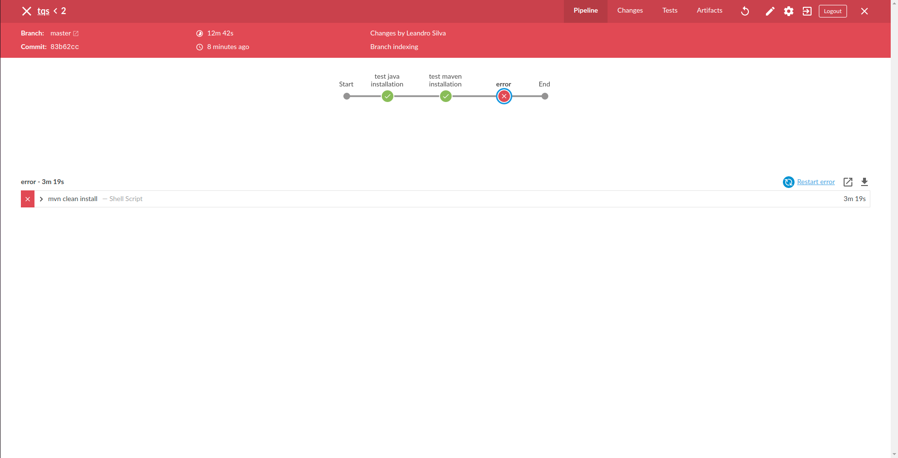

This is the workspace after the creation of a job from a "Maven Project" item. This remote repository was selected as the source code management.

The file pom.xml used was from the /lab4/gs-employee-mngr directory. So this was the project jenkins built.

After a couple of attempts, it was finally able to perform the goal clean install. Then, it was created a simple pipeline for the same Maven project to check the existance of java and maven.

It was able to obtain the Jenkins file at the root of the project, and execute the stages successfully.

This is the pipeline with an extra stage to perform the maven goal clean install. It was necessary to specify the path to the project, since it was not on the root of the repository. The next step was to provoke a fail on a test, which should fail the jenkins build.

Jenkins build did fail, where the reason was the failTest inserted after in the EmployeeRepositoryTest class.

This is the jenkins interface with the blueocean plugin.

Afterwards, I perform the same steps using a dockerized Jenkins. The Jenkins file is now on the root of the repository where the agent is a docker image. 

This is the pipeline results where the stage, where the maven goal clean install is performed gave an error.

The reason was clear. It fail on the same previous test where a fail was provoked.
